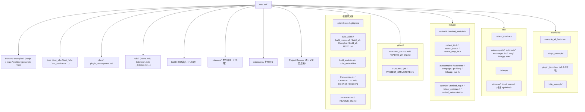

# NetLeaf 项目目录结构

**整理时间**: 2026-10-01
**版本**: v2.4.2

---

## 根目录结构



---

## 模块说明

### 核心模块

| 模块 | 功能 | 头文件 |
|------|------|--------|
| `netleaf` | 核心网络库 | `netleaf.h` |
| `netleaf_module` | NL Extension 系统 | `netleaf_module.h` |
| `netleaf_optimize` | HTTP/WebSocket 优化 | `optimize/netleaf_optimize.h` |

### 功能模块

| 模块 | 功能 | 头文件 |
|------|------|--------|
| `autocomplete` | 自动补全 | `netleaf_autocomplete.h` |
| `autoroute` | 自动路由 | `netleaf_autoroute.h` |
| `errorpage` | 错误页面 | `netleaf_errorpage.h` |
| `ipc` | 进程间通信 | `netleaf_ipc.h` |
| `lang` | 多语言 | `netleaf_lang.h` |
| `linkagg` | 链路聚合 | `netleaf_linkagg.h` |
| `vue` | Vue.js 支持 | `netleaf_vue.h` |
| `mqtt` | MQTT 协议（开发中） | `netleaf_mqtt.h` |

### 平台支持

| 平台 | 源文件目录 | 状态 |
|------|-----------|------|
| Windows | `src/windows/` | 完整支持 |
| Linux | `src/linux/` | 完整支持 |
| macOS | `src/macos/` | 完整支持 |
| Android | `src/linux/`（Bionic 交叉编译） | 核心库完整支持；扩展系统暂不支持（代码保留、后续跟进） |

---

## NL Extension API（v2.4.0）

### 宏定义

```c
// 定义动态加载扩展
NL_EXTENSION_DEFINE(ExtensionName, "Author", "1.0", "Description",
                    NL_PLATFORM_WINDOWS | NL_PLATFORM_LINUX | NL_PLATFORM_MACOS);

// 定义静态链接模块
NL_MODULE_DEFINE(ModuleName, "Author", "1.0", "Description");
```

### 主要 API

| API | 功能 |
|-----|------|
| `nl_extension_init()` | 初始化单个扩展 |
| `nl_extension_init_all()` | 初始化所有扩展 |
| `nl_extension_shutdown()` | 关闭单个扩展 |
| `nl_extension_shutdown_all()` | 关闭所有扩展 |
| `nl_extension_force_shutdown_all()` | 强制关闭所有扩展 |
| `nl_extension_is_initialized()` | 检查扩展是否已初始化 |
| `nl_extension_is_running()` | 检查扩展是否在运行 |
| `nl_extension_get_name()` | 获取扩展名称 |
| `nl_extension_get_author()` | 获取扩展作者 |
| `nl_extension_get_version()` | 获取扩展版本 |
| `nl_extension_supports_platform()` | 检查平台支持 |
| `nl_extension_find_by_capability()` | 按能力搜索扩展 |
| `nl_extension_find_by_platform()` | 按平台搜索扩展 |
| `nl_extension_find_by_name_pattern()` | 按名称模式搜索扩展 |
| `nl_extension_reload()` | 热重载单个扩展 |
| `nl_extension_reload_all()` | 热重载所有扩展 |
| `nl_extension_get_metadata()` | 获取扩展元数据 |
| `nl_extension_set_metadata()` | 设置扩展元数据 |

---

## 注意事项

1. `nul` 文件是 Windows 保留设备名，无法删除，已通过 `.gitignore` 忽略
2. `wiki/` 目录已添加到 `.gitignore`，不提交到仓库
3. `Project-Record/` 目录已添加到 `.gitignore`，用于存储 AI 对话记录
4. `src/mqtt/` 和 `include/netleaf_mqtt.h` 是开发中功能，已添加到 `.gitignore`
5. `build_all-Clang.bat` 和 `build_all-MSVC.bat` 是新构建脚本，已添加到 `.gitignore`

---

*最后更新: 2026-09-18*
