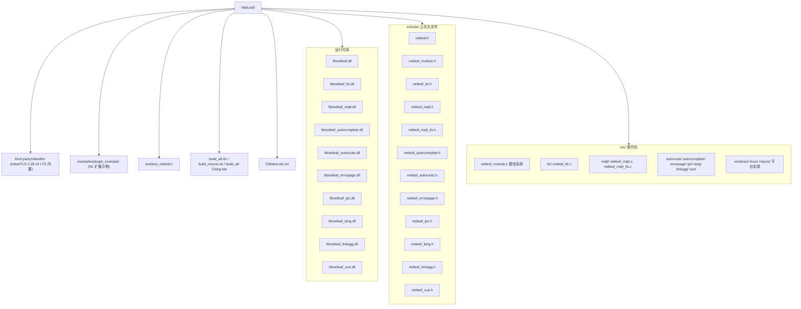
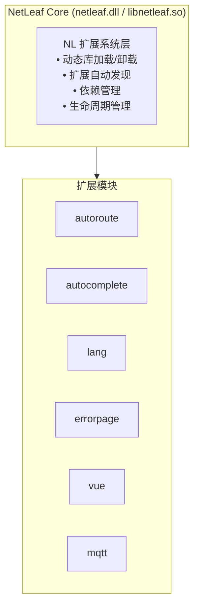

<div align="center">
  
  <h1>NetLeaf</h1>
  <p><b>NetLeaf</b> 是一个现代化的、高性能的网络库，采用 <b>NL扩展系统</b> 架构，支持跨平台运行（Windows/Linux/macOS）。提供 TCP/UDP、HTTP、WebSocket 和 MQTT 协议支持，内置智能路由、自动补全、多语言等扩展模块。</p>
  
  
  <a href="https://github.com/Mbed-TLS/mbedtls"></a>
  <a href="https://mqttt.com"></a>
  <a href="https://opensource.org/license/MIT"></a>
  <a href="https://en.cppreference.com/c"></a>
</div>

## 特性

- **NL扩展系统** - 动态模块加载与管理框架

- **跨平台** - Windows (x86\_64/i686/arm64), Linux, macOS

- **多协议** - TCP, UDP, HTTP, WebSocket, MQTT v3.1.1/v5.0

- **TLS/SSL 加密** - 内置 mbedTLS 2.28.10 (LTS)，支持 TLS 1.0-1.3

- **智能路由** - 自动路由匹配与修正

- **多语言** - 国际化错误消息支持

- **Vue.js 集成** - 后端 Vue 组件生成

- **错误页模板** - 自定义错误页面

- **IPC 通信** - 进程间通信（命名管道/Unix Socket）

- **链接聚合** - 同端口负载均衡

## 项目结构



## 构建要求

- CMake 3.20+

- C 编译器 (MSVC/Clang/GCC)

- Windows: MSYS2/MinGW 或 Visual Studio

- Linux/macOS: GCC/Clang

- TLS/SSL: mbedTLS 2.28.10 LTS (已内置在 third-party/mbedtls/)

## 构建方法

> TLS/SSL 扩展（内置 mbedTLS）已包含在标准/一键构建中，通过 `-DBUILD_TLS=ON` 启用（默认开启）。

### 标准构建 (Windows)

```bash
# 配置项目
cmake -B build -G "MinGW Makefiles" ^
    -DCMAKE_C_COMPILER=x86_64-w64-mingw32-clang.exe ^
    -DCMAKE_MAKE_PROGRAM=C:\msys64\mingw64\bin\make.exe ^
    -DBUILD_MQTT=ON

# 构建
cmake --build build --config Release

# 运行测试
ctest --test-dir build --output-on-failure
```

### 三架构构建

```bash
# x64
cmake -B build/x64 -G "MinGW Makefiles" ^
    -DCMAKE_C_COMPILER=E:\llvm-mingw-ucrt-x86_64\bin\x86_64-w64-mingw32-clang.exe ^
    -DCMAKE_MAKE_PROGRAM=C:\msys64\mingw64\bin\make.exe ^
    -DBUILD_MQTT=ON
cmake --build build/x64 --config Release

# i686
cmake -B build/i686 -G "MinGW Makefiles" ^
    -DCMAKE_C_COMPILER=E:\llvm-mingw-ucrt-x86_64\bin\i686-w64-mingw32-clang.exe ^
    -DCMAKE_MAKE_PROGRAM=C:\msys64\mingw64\bin\make.exe ^
    -DBUILD_MQTT=ON
cmake --build build/i686 --config Release

# ARM64
cmake -B build/aarch64 -G "MinGW Makefiles" ^
    -DCMAKE_C_COMPILER=E:\llvm-mingw-ucrt-x86_64\bin\aarch64-w64-mingw32-clang.exe ^
    -DCMAKE_MAKE_PROGRAM=C:\msys64\mingw64\bin\make.exe ^
    -DBUILD_MQTT=ON
cmake --build build/aarch64 --config Release
```

### Linux/macOS 构建

```bash
cmake -B build -DCMAKE_BUILD_TYPE=Release
cmake --build build --config Release
ctest --test-dir build --output-on-failure
```

## 使用示例

### 基本 HTTP 服务器

```c
#include "netleaf.h"
#include "optimize/netleaf_http.h"
#include <stdio.h>

int main() {
    // 初始化 NL扩展系统
    nl_modules_init();
    
    nl_http_server_t* server = nl_http_server_create(8080);
    
    nl_http_server_set_handler(server, [](const nl_http_request_t* req, 
                                          nl_http_response_t* resp, void* ud) {
        // 路由匹配
        if (nl_route_matches("/api/hello", req->path)) {
            nl_http_response_set_status(resp, 200);
            nl_http_response_set_body(resp, "{\"message\": \"Hello, NetLeaf!\"}", 38);
        }
    }, NULL);
    
    nl_http_server_start(server);
    printf("Server running on http://0.0.0.0:8080\n");
    
    // 运行事件循环
    while (1) {
        nl_modules_tick();
    }
    
    nl_http_server_stop(server);
    nl_modules_shutdown();
    return 0;
}
```

### MQTT 客户端

```c
#include "netleaf.h"
#include "netleaf_mqtt.h"
#include "netleaf_mqtt_tls.h"
#include <stdio.h>

void on_connect(int rc, void* userdata) {
    printf("MQTT connected with result: %d\n", rc);
}

void on_message(const char* topic, const void* payload, size_t len, void* userdata) {
    printf("Received [%s]: %.20s...\n", topic, payload);
}

int main() {
    nl_mqtt_client_t* client = nl_mqtt_create();

    nl_mqtt_connect_opts_t opts = {
        .client_id = "netleaf_client_001",
        .keep_alive = 60,
        .clean_session = true
    };

    // 使用 TLS 连接 (可选)
    nl_mqtt_tls_ctx_t* tls = nl_mqtt_tls_create();
    nl_mqtt_tls_config_t tls_cfg = {
        .ca_file = "ca.crt",
        .verify_peer = 1
    };
    nl_mqtt_tls_configure(tls, &tls_cfg);

    nl_mqtt_connect(client, "broker.hivemq.com", 8883, &opts, on_connect);
    nl_mqtt_subscribe(client, "netleaf/#", &(nl_mqtt_sub_opts_t){.qos = 1}, on_message, NULL);

    // 事件循环
    while (1) {
        nl_mqtt_maintain(client, 1000);
    }

    nl_mqtt_destroy(client);
    return 0;
}
```

## NL扩展系统

### 架构

NL扩展系统是 NetLeaf 的运行时动态扩展框架：



### 检测扩展

通过检查头文件是否存在来判断扩展库是否可用：

```c
// 在 netleaf.h 中
#include "netleaf_autoroute.h"
#include "netleaf_autocomplete.h"
#include "netleaf_errorpage.h"
#include "netleaf_lang.h"
#include "netleaf_vue.h"
#include "netleaf_mqtt.h"
```

### 创建扩展

```c
// my_extension.c
#include "netleaf_module.h"

NL_EXTENSION_DEFINE(
    my_ext,              // extension ID
    "My Extension",      // display name
    "1.0.0",             // version
    "Author Name",       // author
    "My custom extension", // description
    "Windows,Linux,MacOS", // platforms
    NL_CAP_THREAD_SAFE,  // capabilities
    my_init,             // init function
    my_shutdown,         // shutdown function
    my_is_available,     // availability check
    my_version           // version function
);

static int my_init(void) {
    return NL_OK;
}

static void my_shutdown(void) {
    // cleanup
}

static int my_is_available(void) {
    return 1;
}

static const char* my_version(void) {
    return "1.0.0";
}
```

### 使用扩展系统

```c
#include "netleaf_module.h"

// 初始化所有已加载的扩展
nl_extension_init_all();

// 查询扩展信息
nl_extension_info_t* info = nl_extension_access("lang");
printf("Extension: %s (v%s) by %s\n", info->name, info->version, info->author);

// 按能力筛选扩展
nl_extension_info_t* servers[10];
int count = nl_extension_find_by_capability(NL_CAP_SERVER, servers, 10);
for (int i = 0; i < count; i++) {
    printf("Server extension: %s\n", servers[i]->name);
}

// 按平台筛选
nl_extension_info_t* compat[10];
count = nl_extension_find_by_platform("Windows", compat, 10);

// 按名称模式匹配
nl_extension_info_t* matches[10];
count = nl_extension_find_by_name_pattern("*route*", matches, 10);

// 元数据读写
char val[256];
nl_extension_get_metadata("lang", "config_file", val, sizeof(val));
nl_extension_set_metadata("lang", "config_file", "/etc/netleaf/lang.json");

// 单独初始化和关闭
nl_extension_init("vue");
// ... 使用扩展 ...
nl_extension_shutdown("vue");

// 批量关闭所有扩展
nl_extension_shutdown_all();
```

### 创建扩展

```c
// my_extension.c
#include "netleaf_module.h"

NL_EXTENSION_DEFINE(
    my_ext,              // extension ID
    "My Extension",      // display name
    "1.0.0",             // version
    "Author Name",       // author
    "My custom extension", // description
    "Windows,Linux,MacOS", // platforms
    NL_CAP_THREAD_SAFE,  // capabilities
    my_init,             // init function
    my_shutdown,         // shutdown function
    my_is_available,     // availability check
    my_version           // version function
);

static int my_init(void) {
    return NL_OK;
}

static void my_shutdown(void) {
    // cleanup
}

static int my_is_available(void) {
    return 1;
}

static const char* my_version(void) {
    return "1.0.0";
}
```

## 测试

```bash
# 运行所有测试
cmake --build build --target test

# 或
ctest --test-dir build --output-on-failure
```

## 更新日志

### v2.4.1

**Lang 模块增强:**

- 错误码接入多语言：`NL_ERROR_BEGIN/NL_ERROR/NL_ERROR_END` + `nl_lang_register_errors()`，autoroute/autocomplete/errorpage/ipc 等模块返回码统一纳入

- 动态变量：`nl_lang_var_set_provider()` / `nl_lang_var_is_dynamic()`

- 外部变量：`nl_lang_var_bind_env()` / `nl_lang_var_load_env()` / `nl_lang_var_load_file()`

**质量与构建:**

- 清理编译告警（多余分号、末尾换行、dllimport、格式串、未使用项等），修复 MQTT 报文 ID 未初始化等隐患

- 一键脚本完成全平台交叉编译：Windows(x64/x86/arm64)、Linux(13 架构)、macOS(x86_64/arm64)

### v2.4.0

**MQTT 模块增强（v2.4.0）:**

- MQTT v5.0 完整协议支持，包括所有标准属性

- TLS/SSL 加密通信支持（mbedTLS 2.28.10 LTS，TLS 1.0 - TLS 1.3）

- CONNECT/PUBLISH/SUBSCRIBE/UNSUBSCRIBE 完整实现

- QoS 0/1/2 消息质量保障

- MQTT 5.0 属性编码/解码：Payload Format Indicator、Message Expiry Interval、Content Type、Response Topic、Correlation Data、Session Expiry Interval、Topic Alias、Max Packet Size 等

- 主题通配符匹配（`+` 和 `#`）

- 连接认证（用户名/密码）

- 遗嘱消息支持

- 客户端 ID 验证

- 完整的事件循环机制（maintain/connect/disconnect/ping）

- 模块注册系统支持（nl\_mqtt\_init/nl\_mqtt\_get\_module\_info）

- 构建选项：`-DBUILD_MQTT=ON`、`-DMQTT_ENABLE_TLS=ON`

**NL扩展系统 API 导出符号修复:**

- 为 `nl_module_register` 及相关函数添加 `NL_API` 装饰符

- 修复扩展模块链接时找不到核心库符号的问题

**Lang 模块增强（v2.4.0）:**

- 变量替换：`nl_lang_var_set/set_int/set_float/set_bool` + `nl_lang_var_get/get_int/get_float/get_bool`

- 模板替换：`nl_lang_var_replace` — 支持 `{{VAR_NAME}}` 语法，自动 trim 空白

- 条件表达式：`nl_lang_var_condition_eval` — 支持 `== != >= <= > <`，兼容数值与字符串

- 脚本引擎回调：`nl_lang_register_script_engine` / `nl_lang_execute_script` — 可扩展接入 Lua/Python/JS

- 多线程安全：全局变量读写使用 mutex 保护

- 支持最多 128 个并发变量、8 个脚本引擎

**扩展系统 API 增强:**

- 扩展生命周期管理：`nl_extension_init()`、`nl_extension_shutdown()`、`nl_extension_force_shutdown()`

- 扩展状态查询：`nl_extension_is_initialized()`、`nl_extension_is_running()`、`nl_extension_get_state()`

- 扩展信息查询：`nl_extension_get_name()`、`nl_extension_get_author()`、`nl_extension_get_description()`、`nl_extension_get_caps()`

- 平台支持检查：`nl_extension_supports_platform()`

- 批量操作：`nl_extension_init_all()`、`nl_extension_shutdown_all()`、`nl_extension_force_shutdown_all()`

- 扩展搜索过滤：`nl_extension_find_by_capability()`、`nl_extension_find_by_platform()`、`nl_extension_find_by_name_pattern()`

- 热重载支持：`nl_extension_reload()`、`nl_extension_reload_all()`

- 元数据管理：`nl_extension_get_metadata()`、`nl_extension_set_metadata()`

- 自动加载机制优化：支持标准符号命名约定（library\_id\_get\_info、get\_library\_id\_info、library\_id\_extension\_info）

- 所有版本号统一更新为 2.4.0

## 版本历史

| 版本             | 日期         | 更新内容                                                   |
| -------------- | ---------- | ------------------------------------------------------ |
| 2.4.1          | 2026-09-24 | Lang 错误码接入多语言、动态/外部变量；清理编译告警；全平台交叉编译             |
| 2.4.0          | 2026-09-19 | MQTT v5.0 完整协议支持、TLS/SSL 集成(mbedTLS)、NL扩展系统 API 导出符号修复 |
| 2.4.0          | 2026-09-18 | 变量替换、HTML `<var>` 标签格式、NL扩展系统全面增强、完整生命周期管理             |
| 2.2.2-17891424 | 2026-09-12 | NL扩展系统正式命名，MQTT 完整协议支持                                 |
| 2.2.2          | 2026-09-09 | 跨平台构建优化，多目标架构支持                                        |
| 2.2.1          | 2026-09-01 | 修复链接器错误                                                |
| 2.2.0          | 2026-08-25 | 支持 Windows/MacOS/Linux                                 |
| 2.1.0          | 2026-08-20 | 增加路由修正功能                                               |
| 2.0.0          | 2026-08-15 | 重构为模块化架构                                               |

## 许可证

MIT License - 详见 [LICENSE](LICENSE) 文件

## 开源项目来源

本项目的部分功能和实现参考了以下开源项目：

| 项目                     | 用途             | 许可证                   | 仓库链接                                                          |
| ---------------------- | -------------- | --------------------- | ------------------------------------------------------------- |
| **mbedTLS**            | TLS/SSL 加密库    | Apache 2.0 / GPL v2.0 | [Mbed-TLS/mbedTLS](https://github.com/Mbed-TLS/mbedTLS)       |
| **MQTT Specification** | MQTT v5.0 协议规范 | EPL-2.0 / EDL 1.0     | [mqtt.org](https://mqtt.org/)                                 |
| **Paho MQTT C**        | MQTT C 客户端参考实现 | EPL-2.0 / EDL 1.0     | [eclipse/paho.mqtt.c](https://github.com/eclipse/paho.mqtt.c) |

### mbedTLS 集成说明

本项目内置了 mbedTLS 2.28.10 LTS 源码（位于 `third-party/mbedtls/`），用于提供 TLS 1.0 - TLS 1.3 加密支持：

> ⚠️ **安全提示（不推荐 TLS 1.0 / 1.1）**
> TLS 1.0 与 TLS 1.1 已被 [RFC 8996](https://www.rfc-editor.org/rfc/rfc8996) 正式废弃，且存在已知弱点，**不建议在新项目或生产环境中使用**。
> NetLeaf 的 TLS 能力由**独立的 TLS 扩展库**（`netleaf_tls`，内置 mbedTLS）统一负责；虽然为兼容老旧对端保留了 TLS 1.0/1.1，
> 但请务必把 `nl_tls_config_t` 的 `min_proto` 设为 `NL_TLS_PROTO_TLS1_2`（或更高）。

```c
#include "netleaf_tls.h"

// 创建 TLS 上下文
nl_tls_ctx_t* ctx = nl_tls_create();

// 配置证书
nl_tls_config_t cfg = {
    .ca_file = "ca.crt",
    .verify_peer = 1
};
nl_tls_configure(ctx, &cfg);

// 建立安全连接
nl_tls_handshake(ctx, socket_fd);
nl_tls_send(ctx, data, len);
nl_tls_recv(ctx, buffer, bufsize);
```

详细 API 请参考 `include/netleaf_tls.h`。

欢迎提交 Issue 和 Pull Request！

***

