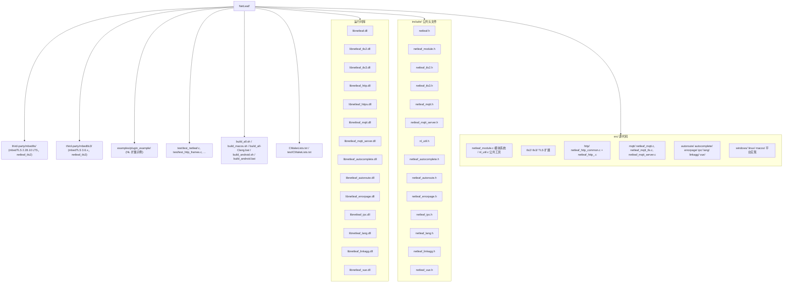
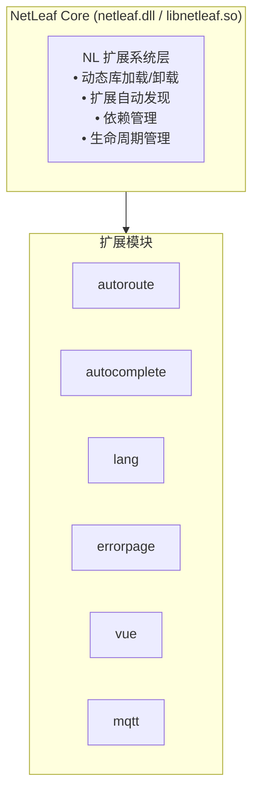

<div align="center">
  
  <h1>NetLeaf</h1>
  <p><b>NetLeaf</b> 是一个现代化的、高性能的网络库，采用 <b>NL扩展系统</b> 架构，支持跨平台运行（Windows/Linux/macOS/Android）。提供 TCP/UDP、HTTP、WebSocket 和 MQTT 协议支持，内置智能路由、自动补全、多语言等扩展模块。</p>
  
  
  <a href="https://github.com/Mbed-TLS/mbedtls"></a>
  <a href="https://mqttt.com"></a>
  <a href="https://opensource.org/license/MIT"></a>
  <a href="https://en.cppreference.com/c"></a>
</div>

## 特性

- **NL扩展系统** - 动态模块加载与管理框架

- **跨平台** - Windows (x86\_64/i686/arm64), Linux, macOS, Android (核心库 arm64-v8a/armeabi-v7a/x86\_64，扩展系统暂不支持)

- **多协议** - TCP, UDP, HTTP, WebSocket, MQTT v3.1.1/v5.0

- **TLS/SSL 加密** - 内置 mbedTLS 2.28.10 (LTS)，支持 TLS 1.0-1.3

- **智能路由** - 自动路由匹配与修正

- **多语言** - 国际化错误消息支持

- **Vue.js 集成** - 后端 Vue 组件生成

- **错误页模板** - 自定义错误页面

- **IPC 通信** - 进程间通信（命名管道/Unix Socket）

- **链接聚合** - 同端口负载均衡

- **多线程** - H1 核心服务端可配置线程池（监听线程 + N 个 worker，支持多用户并发请求）

## 项目结构


```mermaid
flowchart TD
    ROOT["NetLeaf/"]

    subgraph LIB["运行时库"]
        direction LR
        A1[libnetleaf.dll]
        A2[libnetleaf_tls2.dll]
        A3[libnetleaf_tls3.dll]
        A4[libnetleaf_http.dll]
        A5[libnetleaf_https.dll]
        A6[libnetleaf_mqtt.dll]
        A7[libnetleaf_mqtt_server.dll]
        A8[libnetleaf_autocomplete.dll]
        A9[libnetleaf_autoroute.dll]
        A10[libnetleaf_errorpage.dll]
        A11[libnetleaf_ipc.dll]
        A12[libnetleaf_lang.dll]
        A13[libnetleaf_linkagg.dll]
        A14[libnetleaf_vue.dll]
    end

    subgraph INC["include/ 公共头文件"]
        direction LR
        B1[netleaf.h]
        B2[netleaf_module.h]
        B3[netleaf_tls2.h]
        B4[netleaf_tls3.h]
        B5[netleaf_mqtt.h]
        B6[netleaf_mqtt_server.h]
        B7[nl_util.h]
        B8[netleaf_autocomplete.h]
        B9[netleaf_autoroute.h]
        B10[netleaf_errorpage.h]
        B11[netleaf_ipc.h]
        B12[netleaf_lang.h]
        B13[netleaf_linkagg.h]
        B14[netleaf_vue.h]
    end

    subgraph SRC["src/ 源代码"]
        direction TB
        C0[netleaf_module.c 模块系统 / nl_util.c 公共工具]
        C1[tls2/ tls3/ TLS 扩展]
        C2[http/ netleaf_http_common.c + netleaf_http_<plat>.c]
        C3[mqtt/ netleaf_mqtt.c, netleaf_mqtt_tls.c, netleaf_mqtt_server.c]
        C4[autoroute/ autocomplete/ errorpage/ ipc/ lang/ linkagg/ vue/]
        C5[windows/ linux/ macos/ 平台实现]
    end

    ROOT --> LIB
    ROOT --> INC
    ROOT --> SRC
    ROOT --> D1["third-party/mbedtls/ (mbedTLS 2.28.10 LTS，netleaf_tls2)"]
    ROOT --> D2["third-party/mbedtls3/ (mbedTLS 3.6.x，netleaf_tls3)"]
    ROOT --> D3["examples/plugin_example/ (NL 扩展示例)"]
    ROOT --> D4["test/test_netleaf.c, test/test_http_frames.c, ..."]
    ROOT --> D5["build_all.sh / build_macos.sh / build_all-Clang.bat / build_android.sh / build_android.bat"]
    ROOT --> D6["CMakeLists.txt / test/CMakeLists.txt"]
```

## 构建要求

- CMake 3.20+

- C 编译器 (MSVC/Clang/GCC)

- Windows: MSYS2/MinGW 或 Visual Studio

- Linux/macOS: GCC/Clang

- Android: Android NDK r25+（交叉编译，见 [docs/android_build.md](docs/android_build.md)）

- TLS/SSL: mbedTLS 2.28.10 LTS（`netleaf_tls2`，已内置于 third-party/mbedtls/）或 mbedTLS 3.6.x（`netleaf_tls3`，third-party/mbedtls3/）

## 构建方法

> 默认构建即含 MQTT 客户端/服务端（`BUILD_MQTT` / `BUILD_MQTT_SERVER` 默认 `ON`）与 TLS3 扩展（`BUILD_TLS3` 默认 `ON`，构建 `netleaf_tls3` + mbedTLS 3.x）；纯 HTTP 库 `netleaf_http` 与 HTTPS 库 `netleaf_https` 随之生成。`BUILD_TLS`（tls2 后端）默认 `OFF`，与 `BUILD_TLS3` 互斥。

### 标准构建 (Windows)

```bash
# 配置项目（MQTT / TLS3 默认开启，显式传参仅为示例）
cmake -B build -G "MinGW Makefiles" ^
    -DCMAKE_C_COMPILER=x86_64-w64-mingw32-clang.exe ^
    -DCMAKE_MAKE_PROGRAM=C:\msys64\mingw64\bin\make.exe ^
    -DBUILD_MQTT=ON -DBUILD_MQTT_SERVER=ON -DBUILD_TLS3=ON

# 构建
cmake --build build --config Release

# 运行测试
ctest --test-dir build --output-on-failure
```

### 三架构构建

```bash
# x64
cmake -B build/x64 -G "MinGW Makefiles" ^
    -DCMAKE_C_COMPILER=E:\llvm-mingw-ucrt-x86_64\bin\x86_64-w64-mingw32-clang.exe ^
    -DCMAKE_MAKE_PROGRAM=C:\msys64\mingw64\bin\make.exe ^
    -DBUILD_MQTT=ON -DBUILD_TLS3=ON
cmake --build build/x64 --config Release

# i686
cmake -B build/i686 -G "MinGW Makefiles" ^
    -DCMAKE_C_COMPILER=E:\llvm-mingw-ucrt-x86_64\bin\i686-w64-mingw32-clang.exe ^
    -DCMAKE_MAKE_PROGRAM=C:\msys64\mingw64\bin\make.exe ^
    -DBUILD_MQTT=ON -DBUILD_TLS3=ON
cmake --build build/i686 --config Release

# ARM64
cmake -B build/aarch64 -G "MinGW Makefiles" ^
    -DCMAKE_C_COMPILER=E:\llvm-mingw-ucrt-x86_64\bin\aarch64-w64-mingw32-clang.exe ^
    -DCMAKE_MAKE_PROGRAM=C:\msys64\mingw64\bin\make.exe ^
    -DBUILD_MQTT=ON -DBUILD_TLS3=ON
cmake --build build/aarch64 --config Release
```

### Linux/macOS 构建

```bash
cmake -B build -DCMAKE_BUILD_TYPE=Release
cmake --build build --config Release
ctest --test-dir build --output-on-failure
```

### Android 构建（交叉编译）

Android 复用 Linux/epoll 风格的 POSIX 源，CMake 通过 `elseif(ANDROID)` 分支自动切换
编译选项、源文件列表与核心库链接。支持 `arm64-v8a`（推荐）/`armeabi-v7a`/`x86_64`，
`minSdkVersion` 21。

> **范围说明**：Android 覆盖**核心库**（`netleaf_core`）；**扩展系统（NL Extension）
> 暂不支持 Android 运行时**，但源码与构建配置保留，后续按扩展逐个跟进。
> 各扩展共享库在 Android 目标下仍按 Linux 语义构建。

详细指南见 [docs/android_build.md](docs/android_build.md)。

```bash
# Linux / WSL / macOS
chmod +x build_android.sh
./build_android.sh          # 构建全部三 ABI
./build_android.sh aarch64  # 仅 arm64-v8a

# Windows
build_android.bat
build_android.bat aarch64
```

前置条件：Android NDK r25+（`sdkmanager "ndk;27.2.12479018"` 安装），
脚本自动探测 NDK 路径（`ANDROID_NDK_HOME` / 默认目录 / 版本化子目录）。

## 使用示例

### 基本 HTTP 服务器

```c
#include "netleaf.h"
#include "optimize/netleaf_http.h"
#include <stdio.h>

/* HTTP 处理器：纯 C 函数指针（非 C++ lambda）。
 * 注意：*response 必须为堆分配（malloc/calloc/realloc），
 * 传入字符串字面量 / 静态缓冲会在服务端 free(response) 时崩溃；无响应时置 NULL。 */
static void on_http(const nl_http_request_t* req, nl_http_response_t* resp, void* ud) {
    (void)ud;
    const char* path = nlh_req_path(req);

    if (strcmp(path, "/api/hello") == 0) {
        nlh_resp_status(resp, 200);
        nlh_resp_header(resp, "Content-Type", "application/json");
        nlh_resp_body(resp, "{\"message\": \"Hello, NetLeaf!\"}", 38);
    } else {
        nlh_resp_status(resp, 404);
        nlh_resp_body(resp, "Not Found", 9);
    }
}

int main(void) {
    nl_http_server_t* server = nlh_server_create(8080);
    if (!server) {
        return 1;
    }

    nlh_server_set_handler(server, on_http, NULL);
    nlh_server_start(server);
    printf("Server running on http://0.0.0.0:8080\n");

    nlh_server_stop(server);
    nlh_server_destroy(server);
    return 0;
}
```

> **接口短名转接层（`nlh_*`）**：为降低过长接口名的调用冗余，HTTP/H2/H3 接口提供
> 一一对应的短名转接层（`nlh_server_create` / `nlh_h2_create` / `nlh_h3_create` /
> `nlh_req_method` / `nlh_resp_body` …），签名与原长名完全一致、无告警，为推荐用法。
> 原长名（`nl_http_*` / `nl_http2_*` / `nl_http3_*`）保留 deprecated 仅作过渡，
> 调用仍可用但产生编译告警。短名随核心库 `netleaf_core` 导出，
> 实现见 `src/http/netleaf_http_shortnames.c`，头文件 `include/optimize/netleaf_http.h`。

### 反向代理（数据驱动事件引擎，**Beta**）

> ⚠️ **Beta 阶段**：反向代理引擎 API 与行为可能在后续版本调整。
> 三平台实现：Linux `epoll` / macOS `kqueue` / Windows `IOCP`（`select` 兼容回退）。
> **混合路由**：同一 server 内 proxy + static + content + redirect + file 可共存。

NetLeaf 的 Web 反向代理采用**数据驱动的异步并行事件引擎**：连接状态编码为
无状态字节 + 按设备动态定容的 ring buffer，**单线程**通过 `epoll`（Linux）/
`kqueue`（macOS）/ `select`（Windows）多路复用一次泵多个连接，非阻塞 fd +
空闲退避，保持极低占用。`upstream` 前缀决定协议：`tcp://` 纯字节透传，
`http://` / `https://` 重组请求头并透传。`nl_web_start` 检测到 proxy 路由
时自动拉起单线程引擎（不分配 worker 池）。

```c
#include "netleaf.h"

int main(void) {
    nl_web_server_t* server = nl_web_create(8080);
    nl_web_add_proxy(server, "/api/",  "http://127.0.0.1:9000"); // 透明转发 API
    nl_web_add_proxy(server, "/cache/", "tcp://127.0.0.1:6379"); // TCP 透传 Redis
    nl_web_start(server);  // 单线程引擎自动拉起
    // ...
    nl_web_stop(server);
    nl_web_destroy(server);
    return 0;
}
```

### MQTT 客户端

```c
#include "netleaf.h"
#include "netleaf_mqtt.h"
#include <stdio.h>

void on_connect(int rc, void* userdata) {
    printf("MQTT connected with result: %d\n", rc);
}

void on_message(const char* topic, const void* payload, size_t len,
                int qos, int retain, void* userdata) {
    printf("Received [%s] (qos=%d retain=%d): %.20s...\n",
           topic, qos, retain, (const char*)payload);
}

int main(void) {
    nl_mqtt_client_t* client = nl_mqtt_create();

    nl_mqtt_connect_opts_t opts;
    memset(&opts, 0, sizeof(opts));
    opts.client_id     = "netleaf_client_001";
    opts.keep_alive    = 60;
    opts.clean_session = 1;

    /* 可选：启用 TLS 连接（服务端证书需校验时） */
    nl_mqtt_set_tls(client, 1);
    nl_mqtt_set_tls_cert(client, "ca.crt", NULL, NULL);

    nl_mqtt_connect(client, "broker.hivemq.com", 8883, &opts, on_connect);
    nl_mqtt_subscribe(client, "netleaf/#", &(nl_mqtt_sub_opts_t){.qos = 1}, on_message, NULL);

    /* 事件循环 */
    while (nl_mqtt_get_status(client) == NL_MQTT_CONNECTED) {
        nl_mqtt_maintain(client, 1000);
    }

    nl_mqtt_destroy(client);
    return 0;
}
```

## NL扩展系统

### 架构

NL扩展系统是 NetLeaf 的运行时动态扩展框架：


```mermaid
flowchart TD
    subgraph CORE["NetLeaf Core (netleaf.dll / libnetleaf.so)"]
        NL["NL 扩展系统层<br/>• 动态库加载/卸载<br/>• 扩展自动发现<br/>• 依赖管理<br/>• 生命周期管理"]
    end
    subgraph MODS["扩展模块"]
        direction LR
        A1[autoroute]
        A2[autocomplete]
        A3[lang]
        A4[errorpage]
        A5[vue]
        A6[mqtt]
    end
    CORE --> MODS
```

### 检测扩展

通过检查头文件是否存在来判断扩展库是否可用：

```c
// 在 netleaf.h 中
#include "netleaf_autoroute.h"
#include "netleaf_autocomplete.h"
#include "netleaf_errorpage.h"
#include "netleaf_lang.h"
#include "netleaf_vue.h"
#include "netleaf_mqtt.h"
```

### 创建扩展

```c
// my_extension.c
#include "netleaf_module.h"

NL_EXTENSION_DEFINE(
    my_ext,              // extension ID
    "My Extension",      // display name
    "1.0.0",             // version
    "Author Name",       // author
    "My custom extension", // description
    "Windows,Linux,MacOS", // platforms
    NL_CAP_THREAD_SAFE,  // capabilities
    my_init,             // init function
    my_shutdown,         // shutdown function
    my_is_available,     // availability check
    my_version           // version function
);

static int my_init(void) {
    return NL_OK;
}

static void my_shutdown(void) {
    // cleanup
}

static int my_is_available(void) {
    return 1;
}

static const char* my_version(void) {
    return "1.0.0";
}
```

### 使用扩展系统

```c
#include "netleaf_module.h"

// 初始化所有已加载的扩展
nl_extension_init_all();

// 查询扩展信息
nl_extension_info_t* info = nl_extension_access("lang");
printf("Extension: %s (v%s) by %s\n", info->name, info->version, info->author);

// 按能力筛选扩展
nl_extension_info_t* servers[10];
int count = nl_extension_find_by_capability(NL_CAP_SERVER, servers, 10);
for (int i = 0; i < count; i++) {
    printf("Server extension: %s\n", servers[i]->name);
}

// 按平台筛选
nl_extension_info_t* compat[10];
count = nl_extension_find_by_platform("Windows", compat, 10);

// 按名称模式匹配
nl_extension_info_t* matches[10];
count = nl_extension_find_by_name_pattern("*route*", matches, 10);

// 元数据读写
char val[256];
nl_extension_get_metadata("lang", "config_file", val, sizeof(val));
nl_extension_set_metadata("lang", "config_file", "/etc/netleaf/lang.json");

// 单独初始化和关闭
nl_extension_init("vue");
// ... 使用扩展 ...
nl_extension_shutdown("vue");

// 批量关闭所有扩展
nl_extension_shutdown_all();
```

## 测试

```bash
# 运行所有测试
cmake --build build --target test

# 或
ctest --test-dir build --output-on-failure
```

## 更新日志

### v2.4.2

**Android（移动端）构建支持:**

- 新增 `elseif(ANDROID)` CMake 平台分支：复用 Linux/epoll 风格 POSIX 源（Bionic 提供 epoll/poll/socket），编译选项去掉 `-D_FORTIFY_SOURCE`（Bionic `-O0` 下 `__builtin_object_size` 不保证可用），核心库链接去掉 `dl`/`iconv`（Bionic 已并入 libc）并新增 `log`（`__android_log`）。
- Bionic 兼容修复：`netleaf_sysinfo_linux.c` 加 `__ANDROID__` 分支（`__GLIBC__` 在 Bionic 未定义）；`netleaf_http_linux.c` 的 QUIC 连接 ID 生成在 `__ANDROID__` 下改为读 `/dev/urandom`（Bionic 无 `getrandom()`）。
- 新增 `build_android.sh`（Linux/WSL/macOS）与 `build_android.bat`（Windows）一键交叉编译脚本，自动探测 NDK，支持 `arm64-v8a`/`armeabi-v7a`/`x86_64` 三 ABI（minSdk 21）。
- 新增构建文档 [docs/android_build.md](docs/android_build.md)。
- **范围**：Android 覆盖核心库；**扩展系统（NL Extension）暂不支持 Android 运行时**，
  但源码与构建配置保留，后续按扩展逐个跟进。

**HTTPS / TLS 重构:**

- HTTPS 拆出独立库 `netleaf_https`（纯 HTTP 由 `netleaf_http` 承载，不再依赖 TLS）；TLS 扩展拆分为 `netleaf_tls2`（mbedTLS 2.28.10，TLS 1.0–1.3）与新增的 `netleaf_tls3`（mbedTLS 3.6.x，TLS 1.2/1.3），`BUILD_TLS3` 默认开启、与 `BUILD_TLS` 互斥。

- `nl_http_server_enable_tls` / `nl_http_client_connect` 首行加 `nl_tls_is_available()` 运行时门控；未构建 TLS 时 HTTPS API 退化为桩返回 `NL_HTTP_TLS_UNAVAILABLE(-100)`。

**MQTT 默认开启 + 测试拆分:**

- `BUILD_MQTT` / `BUILD_MQTT_SERVER` 默认 `ON`；测试 CMake 从顶层拆到 `test/CMakeLists.txt`。

**公共工具层 `nl_util`:**

- 新增 `include/nl_util.h` + `src/common/nl_util.c`（编入核心库）：`nl_strdup` / `nl_parse_enable_value` / `nl_sha1` / `nl_base64_encode(_into)` / `nl_once_init` 等公共工具，收敛各扩展中的重复拷贝。

**协议层修复与优化:**

- HTTP/2 补全 `END_HEADERS` / `CONTINUATION` / `PUSH_PROMISE` 帧；QUIC 传输层按 RFC 9000 补 `MAX_DATA` / `ACK` / `PING` 等帧，修复 varint 8 字节边界（`≥2^62`）溢出。

- mbedTLS 3.6 API 移植（12 处）；LTO 选项（`NETLEAF_ENABLE_LTO`）不额外提升优化等级；H2/H3 内存占用优化（hpack 动态表瘦身、H3 回包栈缓冲复用）。

**H1 核心服务端线程池（多用户并发优化）:**

- `nl_server_*` 核心 TCP/HTTP/WebSocket 服务由「单线程事件循环」升级为「可配置线程池工作模型」：监听线程（accept 循环）+ N 个 worker 线程，支持多用户并发请求；UDP 路径保持单线程。
- 新增 `nl_socket_option_t` 枚举值 `NL_OPT_CONCURRENCY`（worker 池大小，合法范围 1..64，默认 4，仅 TCP 有效）与便捷函数 `int nl_server_set_concurrency(nl_server_t* server, int concurrency)`；同步接入 `nl_server_set_option` / `nl_server_get_option`。
- 跨平台同步原语：POSIX（Linux/macOS）用 `pthread_t*` + `pthread_mutex_t` + 两个 `pthread_cond_t`；Windows 用 `HANDLE*`（`CreateThread`）+ `CRITICAL_SECTION` + 两个自动复位事件。

**验证:** `test_http_frames` 16/16 通过；ctest 7/7 通过；macOS 全量实编通过；Linux 13 架构（含 amd64 原生 + TLS3/HTTPS）实编通过；Windows LLVM-MinGW x64 实编通过；并发冒烟测试 32/32（16 worker）成功。

### v2.4.1

**Lang 模块增强:**

- 错误码接入多语言：`NL_ERROR_BEGIN/NL_ERROR/NL_ERROR_END` + `nl_lang_register_errors()`，autoroute/autocomplete/errorpage/ipc 等模块返回码统一纳入

- 动态变量：`nl_lang_var_set_provider()` / `nl_lang_var_is_dynamic()`

- 外部变量：`nl_lang_var_bind_env()` / `nl_lang_var_load_env()` / `nl_lang_var_load_file()`

**质量与构建:**

- 清理编译告警（多余分号、末尾换行、dllimport、格式串、未使用项等），修复 MQTT 报文 ID 未初始化等隐患

- 一键脚本完成全平台交叉编译：Windows(x64/x86/arm64)、Linux(13 架构)、macOS(x86_64/arm64)

### v2.4.0

**MQTT 模块增强（v2.4.0）:**

- MQTT v5.0 完整协议支持，包括所有标准属性

- TLS/SSL 加密通信支持（mbedTLS 2.28.10 LTS，TLS 1.0 - TLS 1.3）

- CONNECT/PUBLISH/SUBSCRIBE/UNSUBSCRIBE 完整实现

- QoS 0/1/2 消息质量保障

- MQTT 5.0 属性编码/解码：Payload Format Indicator、Message Expiry Interval、Content Type、Response Topic、Correlation Data、Session Expiry Interval、Topic Alias、Max Packet Size 等

- 主题通配符匹配（`+` 和 `#`）

- 连接认证（用户名/密码）

- 遗嘱消息支持

- 客户端 ID 验证

- 完整的事件循环机制（maintain/connect/disconnect/ping）

- 模块注册系统支持（nl\_mqtt\_init/nl\_mqtt\_get\_module\_info）

- 构建选项：`-DBUILD_MQTT=ON`、`-DMQTT_ENABLE_TLS=ON`

**NL扩展系统 API 导出符号修复:**

- 为 `nl_module_register` 及相关函数添加 `NL_API` 装饰符

- 修复扩展模块链接时找不到核心库符号的问题

**Lang 模块增强（v2.4.0）:**

- 变量替换：`nl_lang_var_set/set_int/set_float/set_bool` + `nl_lang_var_get/get_int/get_float/get_bool`

- 模板替换：`nl_lang_var_replace` — 支持 `{{VAR_NAME}}` 语法，自动 trim 空白

- 条件表达式：`nl_lang_var_condition_eval` — 支持 `== != >= <= > <`，兼容数值与字符串

- 脚本引擎回调：`nl_lang_register_script_engine` / `nl_lang_execute_script` — 可扩展接入 Lua/Python/JS

- 多线程安全：全局变量读写使用 mutex 保护

- 支持最多 128 个并发变量、8 个脚本引擎

**扩展系统 API 增强:**

- 扩展生命周期管理：`nl_extension_init()`、`nl_extension_shutdown()`、`nl_extension_force_shutdown()`

- 扩展状态查询：`nl_extension_is_initialized()`、`nl_extension_is_running()`、`nl_extension_get_state()`

- 扩展信息查询：`nl_extension_get_name()`、`nl_extension_get_author()`、`nl_extension_get_description()`、`nl_extension_get_caps()`

- 平台支持检查：`nl_extension_supports_platform()`

- 批量操作：`nl_extension_init_all()`、`nl_extension_shutdown_all()`、`nl_extension_force_shutdown_all()`

- 扩展搜索过滤：`nl_extension_find_by_capability()`、`nl_extension_find_by_platform()`、`nl_extension_find_by_name_pattern()`

- 热重载支持：`nl_extension_reload()`、`nl_extension_reload_all()`

- 元数据管理：`nl_extension_get_metadata()`、`nl_extension_set_metadata()`

- 自动加载机制优化：支持标准符号命名约定（library\_id\_get\_info、get\_library\_id\_info、library\_id\_extension\_info）

- 所有版本号统一更新为 2.4.0

## 版本历史

| 版本             | 日期         | 更新内容                                                   |
| -------------- | ---------- | ------------------------------------------------------ |
| 2.4.2          | 2026-09-30 | HTTPS/TLS 重构（`netleaf_https` 独立、TLS 拆分 tls2/tls3）；MQTT 默认开启；`nl_util` 公共工具层；H2/QUIC 帧补全与 varint 溢出修复；H2/H3 内存优化；LTO 选项 |
| 2.4.2-android  | 2026-10-01 | Android 核心库构建支持（CMake ANDROID 分支、Bionic 兼容修复、双构建脚本、docs）；扩展系统暂不支持、代码保留后续跟进 |
| 2.4.1          | 2026-09-24 | Lang 错误码接入多语言、动态/外部变量；清理编译告警；全平台交叉编译             |
| 2.4.0          | 2026-09-19 | MQTT v5.0 完整协议支持、TLS/SSL 集成(mbedTLS)、NL扩展系统 API 导出符号修复 |
| 2.4.0          | 2026-09-18 | 变量替换、HTML `<var>` 标签格式、NL扩展系统全面增强、完整生命周期管理             |
| 2.2.2-17891424 | 2026-09-12 | NL扩展系统正式命名，MQTT 完整协议支持                                 |
| 2.2.2          | 2026-09-09 | 跨平台构建优化，多目标架构支持                                        |
| 2.2.1          | 2026-09-01 | 修复链接器错误                                                |
| 2.2.0          | 2026-08-25 | 支持 Windows/MacOS/Linux                                 |
| 2.1.0          | 2026-08-20 | 增加路由修正功能                                               |
| 2.0.0          | 2026-08-15 | 重构为模块化架构                                               |

## 许可证

MIT License - 详见 [LICENSE](LICENSE) 文件

## 开源项目来源

本项目的部分功能和实现参考了以下开源项目：

| 项目                     | 用途             | 许可证                   | 仓库链接                                                          |
| ---------------------- | -------------- | --------------------- | ------------------------------------------------------------- |
| **mbedTLS**            | TLS/SSL 加密库    | Apache 2.0 / GPL v2.0 | [Mbed-TLS/mbedTLS](https://github.com/Mbed-TLS/mbedTLS)       |
| **MQTT Specification** | MQTT v5.0 协议规范 | EPL-2.0 / EDL 1.0     | [mqtt.org](https://mqtt.org/)                                 |
| **Paho MQTT C**        | MQTT C 客户端参考实现 | EPL-2.0 / EDL 1.0     | [eclipse/paho.mqtt.c](https://github.com/eclipse/paho.mqtt.c) |

### mbedTLS 集成说明

本项目内置了 mbedTLS 2.28.10 LTS 源码（位于 `third-party/mbedtls/`），用于提供 TLS 1.0 - TLS 1.3 加密支持：

> ⚠️ **安全提示（不推荐 TLS 1.0 / 1.1）**
> TLS 1.0 与 TLS 1.1 已被 [RFC 8996](https://www.rfc-editor.org/rfc/rfc8996) 正式废弃，且存在已知弱点，**不建议在新项目或生产环境中使用**。
> NetLeaf 的 TLS 能力由**独立的 TLS 扩展库**（`netleaf_tls2`，内置 mbedTLS 2.28.10；或 `netleaf_tls3`，内置 mbedTLS 3.6.x）统一负责；虽然为兼容老旧对端保留了 TLS 1.0/1.1，
> 但请务必把 `nl_tls2_config_t` 的 `min_proto` 设为 `NL_TLS2_PROTO_TLS1_2`（或更高）。

```c
#include "netleaf_tls2.h"

// 创建 TLS 上下文
nl_tls2_ctx_t* ctx = nl_tls2_create();

// 配置证书
nl_tls2_config_t cfg;
memset(&cfg, 0, sizeof(cfg));
cfg.ca_file     = "ca.crt";
cfg.verify_peer = 1;
nl_tls2_configure(ctx, &cfg);

// 建立安全连接
nl_tls2_handshake(ctx, socket_fd);
nl_tls2_send(ctx, data, len);
nl_tls2_recv(ctx, buffer, bufsize);
```

详细 API 请参考 `include/netleaf_tls2.h`（TLS 1.0–1.3，mbedTLS 2.28.10）或 `include/netleaf_tls3.h`（TLS 1.2/1.3，mbedTLS 3.6.x）。

欢迎提交 Issue 和 Pull Request！

***

